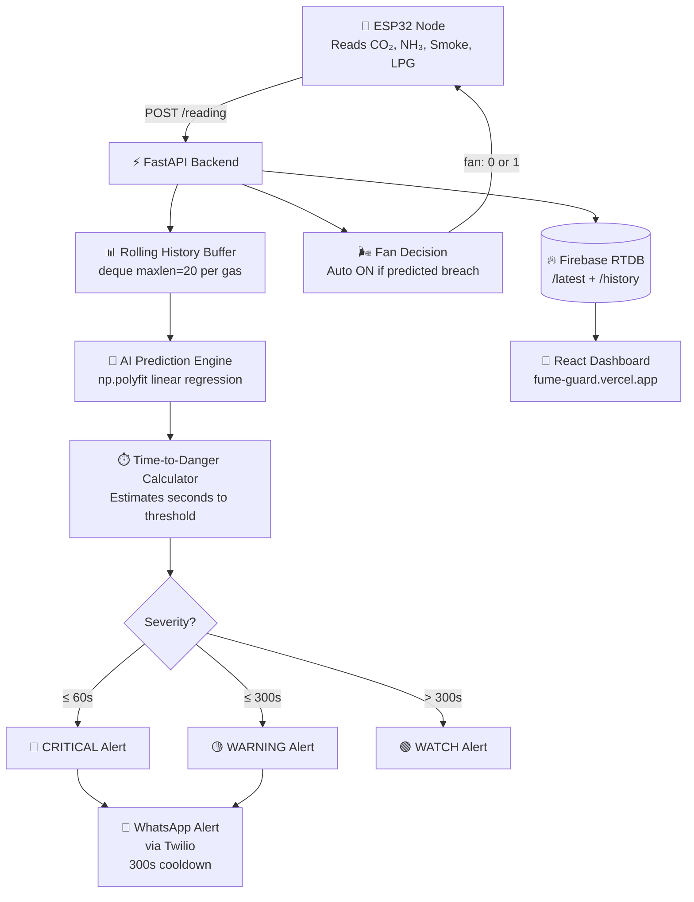

<div align="center">


<br/>

<p>
  
  
  
  
  
  
</p>

<br/>

> **☠️ Real-time gas detection + predictive AI that tells you exactly how many seconds before the air becomes dangerous — and acts before you have to.**

<br/>

[](https://fume-guard.vercel.app)

</div>

---

## 🧭 Table of Contents

- [What is FumeGuard?](#-what-is-fumeguard)
- [Sensors & What They Detect](#-sensors--what-they-detect)
- [How It Works](#️-how-it-works)
- [AI Prediction Engine](#-ai-prediction-engine)
- [Alert System](#-alert-system)
- [Architecture](#️-architecture)
- [Tech Stack](#-tech-stack)
- [Project Structure](#-project-structure)
- [Setup & Run](#-setup--run)
- [API Reference](#-api-reference)
- [Danger Thresholds](#️-danger-thresholds)
- [Future Scope](#-future-scope)

---

## 🌟 What is FumeGuard?

**FumeGuard** is a full-stack IoT air quality monitoring system that goes beyond simple threshold alerts. It combines an **ESP32 sensor node**, a **predictive AI backend**, a **real-time Firebase database**, and a **live React dashboard** to answer one critical question:

```
Not just "is the air dangerous right now?"
But → "HOW MANY SECONDS until it becomes dangerous?"
```

The system continuously reads gas levels, runs linear regression over a rolling window of sensor history, and predicts whether conditions will cross danger thresholds — **before they do**. It then automatically controls an exhaust fan and fires WhatsApp alerts with severity levels.

---

## 🧪 Sensors & What They Detect

<div align="center">

| Sensor | Gas Detected | Danger Threshold | Risk |
|:---:|:---:|:---:|:---|
| 💨 **CO₂ Sensor** | Carbon Dioxide | 500 ppm | Headaches, suffocation at high levels |
| 🟡 **NH₃ Sensor** | Ammonia | — (monitored) | Toxic at high concentrations |
| 🔴 **Smoke Sensor** | Combustion Smoke | 300 units | Fire indicator, respiratory hazard |
| 🟠 **LPG Sensor** | Liquefied Petroleum Gas | 1000 ppm | Explosion / fire risk |

</div>

---

## ⚙️ How It Works



---

## 🧠 AI Prediction Engine

The backend doesn't just read current values — it **predicts the future** using a lightweight linear regression model on a rolling 20-reading window:

### Prediction Logic

```python
def predict(history, steps=10):
    x = np.arange(len(history))
    y = np.array(history)
    m, b = np.polyfit(x, y, 1)          # Fit linear trend
    future = m * (len(history) + steps) + b   # Project forward
    return max(0, round(future))
```

### Time-to-Danger Calculation

```python
def time_to_danger(current, history, threshold):
    m, _ = np.polyfit(x, y, 1)          # Rate of change
    steps = (threshold - current) / m   # Steps until breach
    return int(steps * 5)               # Convert to seconds
```

> The system samples every ~5 seconds. If CO₂ is rising at a rate that will cross 500 ppm in 12 steps → **Time to Danger = 60 seconds → CRITICAL alert fires.**

### Fan Auto-Control

```python
def decide_fan(pred_co2, pred_lpg):
    if pred_co2 > DANGER["co2"] or pred_lpg > DANGER["lpg"]:
        return 1    # Fan ON
    return 0        # Fan OFF
```

The fan decision is returned directly to the ESP32 in the API response — **no human intervention needed.**

---

## 🚨 Alert System

FumeGuard sends **WhatsApp alerts via Twilio** with three severity tiers and a **5-minute cooldown** to prevent spam:

<div align="center">

| Severity | Condition | Action |
|:---:|:---:|:---|
| 🔴 **CRITICAL** | ≤ 60 seconds to danger | Immediate WhatsApp alert sent |
| 🟡 **WARNING** | ≤ 300 seconds to danger | WhatsApp alert sent |
| 🟢 **WATCH** | > 300 seconds to danger | Alert only if severity changed |
| ✅ **Safe** | No trend toward danger | No alert |

</div>

**Sample Alert Message:**
```
FumeGuard Alert: CRITICAL
Time to danger: 45s
Fan: ON
Current  — CO2: 480, NH3: 12, Smoke: 270, LPG: 850
Predicted — CO2: 530, Smoke: 320, LPG: 1100
```

---

## 🏗️ Architecture

```
┌──────────────────────────────────────────────────────────────┐
│                    ESP32 SENSOR NODE (Edge)                  │
│   CO₂ │ NH₃ │ Smoke │ LPG   →   C++ Firmware (esp32_server) │
│               POST /reading every ~5s                        │
└──────────────────────────┬───────────────────────────────────┘
                           │  JSON sensor payload
                           ▼
┌──────────────────────────────────────────────────────────────┐
│              FASTAPI BACKEND (app.py)                        │
│                                                              │
│  Rolling Window (deque 20)  →  np.polyfit prediction        │
│  Time-to-Danger calculator  →  Fan ON/OFF decision          │
│  Severity classifier        →  Twilio WhatsApp alerts       │
│                                                              │
│  Returns: { "fan": 0 or 1 }  ←──────── to ESP32            │
└────────────┬─────────────────────────────────────────────────┘
             │
             ▼
┌──────────────────────────────────────────────────────────────┐
│            FIREBASE REALTIME DATABASE                        │
│   /latest  →  Most recent reading + predictions             │
│   /history →  Full push log of all events                   │
└────────────┬─────────────────────────────────────────────────┘
             │
             ▼
┌──────────────────────────────────────────────────────────────┐
│         REACT DASHBOARD  (fume-guard.vercel.app)            │
│   Real-time gas levels │ Prediction charts │ Danger timer   │
│   Fan status │ Alert history │ Live severity indicator      │
└──────────────────────────────────────────────────────────────┘
```

---

## 🧰 Tech Stack

<div align="center">

### 🔩 Hardware


### ⚡ Backend


### 🔥 Database & Alerts


### 💻 Frontend


</div>

---

## 📁 Project Structure

```
fume_guard/
│
├── 📂 esp32_server/           # ESP32 C++ firmware
│   └── *.cpp / *.ino         # Sensor reads + WiFi POST to backend
│
├── 📂 src/                    # React frontend source
│   └── components, pages...  # Dashboard UI
│
├── ⚡ app.py                  # FastAPI backend (prediction + alerts)
├── 🌐 index.html              # React entry point
├── ⚙️  vite.config.js         # Vite build config
├── 🔧 eslint.config.js        # ESLint rules
├── 📦 package.json            # Node dependencies
└── 📋 requirements.txt        # Python dependencies
```

---

## 🚀 Setup & Run

### 1. Clone the Repository

```bash
git clone https://github.com/avinashmaharoliya/fume_guard.git
cd fume_guard
```

### 2. Backend Setup

```bash
pip install -r requirements.txt

# Set environment variables
export WHATSAPP_ALERTS_ENABLED=true
export TWILIO_ACCOUNT_SID=your_sid
export TWILIO_AUTH_TOKEN=your_token
export TWILIO_WHATSAPP_FROM=whatsapp:+14155238886
export ALERT_WHATSAPP_TO=whatsapp:+91xxxxxxxxxx
export ALERT_COOLDOWN_SECONDS=300

# Add your Firebase key
# Place firebase_api.json in the root directory

# Start backend
uvicorn app:app --reload --port 8000
```

### 3. Frontend Setup

```bash
npm install
npm run dev
```

### 4. ESP32 Firmware

```
- Open esp32_server/ in Arduino IDE or PlatformIO
- Set your WiFi SSID, password, and backend URL
- Flash to ESP32
- Sensors start posting to /reading automatically
```

---

## 🔌 API Reference

| Method | Endpoint | Description |
|:---:|:---|:---|
| `POST` | `/reading` | Receive sensor data, run prediction, return fan signal |
| `GET` | `/` | Health check — `{"status": "Backend Running"}` |

**POST `/reading` — Request Body:**

```json
{
  "co2": 420.5,
  "nh3": 10.2,
  "smoke": 180.0,
  "lpg": 650.0
}
```

**Response:**

```json
{
  "fan": 1
}
```

---

## ⚠️ Danger Thresholds

```
CO₂   ──────────────────────────────── 500 ppm   →  DANGER
LPG   ──────────────────────────────── 1000 ppm  →  DANGER
Smoke ──────────────────────────────── 300 units →  DANGER
NH₃   ──────────── monitored (custom threshold)
```

> Alert pre-fire begins at **60% of threshold** to ensure adequate warning time.

---

## 🔮 Future Scope

- [ ] 📡 Multiple ESP32 nodes for room-by-room monitoring
- [ ] 🧠 LSTM-based deep learning for non-linear gas trend prediction
- [ ] 📱 Push notifications via mobile app (PWA)
- [ ] 🗺️ Floor plan heatmap overlay for multi-zone deployment
- [ ] 📊 Historical analytics dashboard with trend graphs
- [ ] 🔔 Telegram / Email alert channels alongside WhatsApp

---

## 📌 Note

> FumeGuard is a **functional IoT prototype**. Always use certified industrial gas detectors for safety-critical environments. This system is designed to supplement, not replace, professional gas detection equipment.

---

<div align="center">


*Detect. Predict. Protect.* 🛡️

</div>

